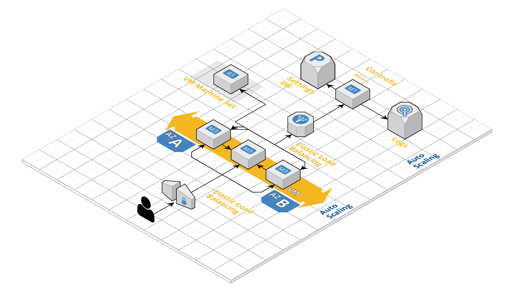

## Master Controller

#### Architecture 

#### Implemented Azure Architecture
- Every node (VM) in the network has its own Virtual Network (VNet) which is peered to each other
- All nodes communicate through gateways and VPN
- A Load Balancer for the the main controller Node
- Auto Scalled brought up VM Machine Sets in unique Nodes for intensive CPU computation tasks
- Azure Dashboards with CPU / Bandwidth / IO Ops

#### Implemented Endpoint
- An endpoint to fetch all the VM IP's from a specific Azure Resource

#### Optimisations
- gRPC protocol for intercommunication of services
- ElasticSearch - ELK Stash for logging
- RDS DB for explicit settings, which will control the various nodes.
- Auto Deploy of templates to new nodes